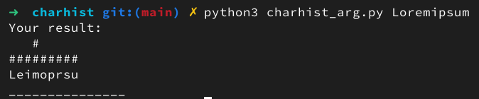
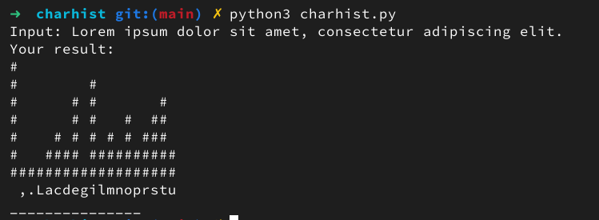

Python-скрипт, позволяющий вывести в консоль диаграмму от количества встречаемых в аргументе символов.

Использование:

	python3 charhist_arg.py <your_args>

или

	python3 charhist.py
	<your_string>

